# DATABASE_SCHEMA

## 1. Vision General
La base de datos PostgreSQL esta diseniada para un sistema ERP/POS **Multi-Tenant** orientado a multiples empresas y tiendas, con operacion **offline** por dispositivo y soporte estricto de normativas fiscales **VeriFactu**. El modelo prioriza **integridad fiscal**, **trazabilidad**, **auditoria** y **consistencia matematica** en documentos de venta, manteniendo aislamiento por `company_id` y `store_id` y aplicando controles de inmutabilidad y secuenciacion en la cadena fiscal.

## 2. Diagrama de Entidad-Relacion (ERD)

```mermaid
erDiagram
%% ORGANIZACION
COMPANIES {
  UUID id PK
  VARCHAR name
  VARCHAR tax_id
}
STORES {
  UUID id PK
  UUID company_id FK
  VARCHAR code
}
STORE_SETTINGS {
  UUID store_id PK, FK
}
WAREHOUSES {
  UUID id PK
  UUID company_id FK
  UUID store_id FK
}

%% SEGURIDAD
USERS {
  BIGINT id PK
  UUID company_id FK
  UUID store_id FK
  VARCHAR role
}
DEVICES {
  UUID id PK
  UUID store_id FK
  VARCHAR serial_code
}
REGISTRATION_CODES {
  VARCHAR code PK
  UUID store_id FK
}

%% CATALOGO
TAXES {
  BIGINT id PK
  UUID company_id FK
  DECIMAL rate
}
CATEGORIES {
  BIGINT id PK
  UUID company_id FK
  BIGINT parent_id FK
}
PRODUCTS {
  BIGINT id PK
  UUID company_id FK
  BIGINT category_id FK
  BIGINT tax_id FK
}
PRODUCT_BARCODES {
  VARCHAR barcode PK
  BIGINT product_id FK
}
TARIFFS {
  BIGINT id PK
  UUID company_id FK
}
PRODUCT_PRICES {
  BIGINT product_id PK, FK
  BIGINT tariff_id PK, FK
}

%% CRM Y PROVEEDORES
CUSTOMERS {
  BIGINT id PK
  UUID company_id FK
}
SUPPLIERS {
  BIGINT id PK
  UUID company_id FK
}
CUSTOMER_PRODUCT_PRICES {
  BIGINT customer_id PK, FK
  BIGINT product_id PK, FK
}
PRICING_RULES {
  BIGINT id PK
  UUID company_id FK
}
CUSTOMER_ACCOUNT_MOVEMENTS {
  BIGINT id PK
  BIGINT customer_id FK
}

%% INVENTARIO Y COMPRAS
INVENTORY_STOCK {
  BIGINT product_id PK, FK
  UUID warehouse_id PK, FK
}
INVENTORY_LOTS {
  BIGINT id PK
  BIGINT product_id FK
  UUID warehouse_id FK
}
STOCK_MOVEMENTS {
  BIGINT id PK
  UUID company_id FK
  BIGINT product_id FK
  UUID warehouse_id FK
}
STOCK_TRANSFERS {
  BIGINT id PK
  UUID company_id FK
  UUID from_warehouse_id FK
  UUID to_warehouse_id FK
}
STOCK_TRANSFER_LINES {
  BIGINT id PK
  BIGINT transfer_id FK
  BIGINT product_id FK
}
STOCK_COUNTS {
  BIGINT id PK
  UUID company_id FK
  UUID warehouse_id FK
}
STOCK_COUNT_LINES {
  BIGINT id PK
  BIGINT stock_count_id FK
  BIGINT product_id FK
}
PURCHASE_ORDERS {
  BIGINT id PK
  UUID company_id FK
  UUID warehouse_id FK
  BIGINT supplier_id FK
}
PURCHASE_ORDER_LINES {
  BIGINT id PK
  BIGINT purchase_order_id FK
  BIGINT product_id FK
}

%% VENTAS
DOC_SEQUENCES {
  UUID store_id PK, FK
  VARCHAR series PK
  INT year PK
}
DEVICE_SEQUENCES {
  UUID device_id PK, FK
  VARCHAR series PK
  INT year PK
}
SHIFTS {
  UUID id PK
  UUID store_id FK
  UUID device_id FK
}
CASH_MOVEMENTS {
  UUID id PK
  UUID shift_id FK
}
SALES {
  BIGINT id PK
  UUID uuid
  UUID company_id FK
  UUID store_id FK
  UUID device_id FK
}
SALE_LINES {
  BIGINT id PK
  UUID sale_uuid FK
  BIGINT product_id FK
}
SALE_TAXES {
  BIGINT id PK
  UUID sale_uuid FK
  BIGINT tax_id FK
}
PAYMENTS {
  BIGINT id PK
  UUID sale_uuid FK
  BIGINT payment_method_id FK
}
SYNC_LOGS {
  BIGINT id PK
  UUID device_id FK
}

%% FISCAL
FISCAL_AUDIT_LOG {
  BIGINT id PK
  UUID sale_uuid FK
  UUID device_id FK
  INT chain_sequence_id
}

%% CONTABILIDAD Y AUDITORIA
ACCOUNTING_ENTRIES {
  BIGINT id PK
  UUID company_id FK
}
ACCOUNTING_ENTRY_LINES {
  BIGINT id PK
  BIGINT entry_id FK
}
AUDIT_USER_ACTIONS {
  BIGINT id PK
  BIGINT user_id FK
}
DOMAIN_EVENTS {
  BIGINT id PK
}

COMPANIES ||--o{ STORES : owns
STORES ||--|| STORE_SETTINGS : config
COMPANIES ||--o{ WAREHOUSES : owns
STORES ||--o{ WAREHOUSES : hosts
COMPANIES ||--o{ USERS : employs
STORES ||--o{ USERS : assigns
STORES ||--o{ DEVICES : has
STORES ||--o{ REGISTRATION_CODES : issues
COMPANIES ||--o{ TAXES : defines
COMPANIES ||--o{ CATEGORIES : defines
CATEGORIES ||--o{ CATEGORIES : parent
COMPANIES ||--o{ PRODUCTS : owns
CATEGORIES ||--o{ PRODUCTS : classifies
TAXES ||--o{ PRODUCTS : applies
PRODUCTS ||--o{ PRODUCT_BARCODES : has
COMPANIES ||--o{ TARIFFS : defines
PRODUCTS ||--o{ PRODUCT_PRICES : priced
TARIFFS ||--o{ PRODUCT_PRICES : priced
COMPANIES ||--o{ CUSTOMERS : serves
COMPANIES ||--o{ SUPPLIERS : works
CUSTOMERS ||--o{ CUSTOMER_PRODUCT_PRICES : overrides
PRODUCTS ||--o{ CUSTOMER_PRODUCT_PRICES : overrides
COMPANIES ||--o{ PRICING_RULES : config
CUSTOMERS ||--o{ CUSTOMER_ACCOUNT_MOVEMENTS : ledger
PRODUCTS ||--o{ INVENTORY_STOCK : stock
WAREHOUSES ||--o{ INVENTORY_STOCK : stock
PRODUCTS ||--o{ INVENTORY_LOTS : lots
WAREHOUSES ||--o{ INVENTORY_LOTS : lots
COMPANIES ||--o{ STOCK_MOVEMENTS : movement
PRODUCTS ||--o{ STOCK_MOVEMENTS : movement
WAREHOUSES ||--o{ STOCK_MOVEMENTS : movement
COMPANIES ||--o{ STOCK_TRANSFERS : transfer
STOCK_TRANSFERS ||--o{ STOCK_TRANSFER_LINES : lines
PRODUCTS ||--o{ STOCK_TRANSFER_LINES : items
COMPANIES ||--o{ STOCK_COUNTS : counts
STOCK_COUNTS ||--o{ STOCK_COUNT_LINES : lines
PRODUCTS ||--o{ STOCK_COUNT_LINES : items
COMPANIES ||--o{ PURCHASE_ORDERS : orders
SUPPLIERS ||--o{ PURCHASE_ORDERS : orders
PURCHASE_ORDERS ||--o{ PURCHASE_ORDER_LINES : lines
PRODUCTS ||--o{ PURCHASE_ORDER_LINES : items
STORES ||--o{ DOC_SEQUENCES : seq
DEVICES ||--o{ DEVICE_SEQUENCES : seq
STORES ||--o{ SHIFTS : shifts
DEVICES ||--o{ SHIFTS : shifts
SHIFTS ||--o{ CASH_MOVEMENTS : cash
COMPANIES ||--o{ SALES : sales
STORES ||--o{ SALES : sales
DEVICES ||--o{ SALES : sales
SALES ||--o{ SALE_LINES : lines
PRODUCTS ||--o{ SALE_LINES : items
SALES ||--o{ SALE_TAXES : taxes
TAXES ||--o{ SALE_TAXES : taxes
SALES ||--o{ PAYMENTS : pays
DEVICES ||--o{ SYNC_LOGS : sync
SALES ||--o{ FISCAL_AUDIT_LOG : audit
DEVICES ||--o{ FISCAL_AUDIT_LOG : audit
COMPANIES ||--o{ ACCOUNTING_ENTRIES : entries
ACCOUNTING_ENTRIES ||--o{ ACCOUNTING_ENTRY_LINES : lines
USERS ||--o{ AUDIT_USER_ACTIONS : actions
```

## 3. Detalle de Modulos

### 1) Organizacion (Multi-Tenant / Multi-Company)

#### `companies`
**Descripcion:** Entidades legales del sistema. Define el ambito principal de aislamiento de datos.
**Estructura:**
| Nombre | Tipo de Dato | Restricciones | Descripcion |
| --- | --- | --- | --- |
| `id` | UUID | PK, Default | Identificador unico. |
| `name` | VARCHAR(255) | Not Null | Nombre legal. |
| `tax_id` | VARCHAR(50) | Not Null | CIF/NIF. |
| `currency_code` | VARCHAR(3) | Default | Moneda base (EUR). |
| `fiscal_regime` | VARCHAR(50) | Default | Regimen fiscal. Valores: `COMMON`, `SII`, `CANARY_IGIC`. |
| `price_includes_tax` | BOOLEAN | Default | Si los precios incluyen impuestos. |
| `rounding_mode` | VARCHAR(20) | Default | Redondeo. Valores: `LINE`, `TOTAL`. |
| `is_active` | BOOLEAN | Default | Estado activo. |
| `created_at` | TIMESTAMPTZ | Default | Alta. |
| `updated_at` | TIMESTAMPTZ | Default | Ultima actualizacion. |
| `deleted_at` | TIMESTAMPTZ |  | Borrado logico. |
| `version` | BIGINT | Default | Control de versiones. |
**Relaciones:** `stores`, `warehouses`, `users`, `taxes`, `categories`, `products`, `tariffs`, `customers`, `suppliers`, `stock_movements`, `stock_counts`, `purchase_orders`, `sales`, `accounting_entries`.
**Indices y Optimizaciones:** Ninguno especifico.

#### `stores`
**Descripcion:** Tiendas o sucursales operativas dentro de una empresa.
**Estructura:**
| Nombre | Tipo de Dato | Restricciones | Descripcion |
| --- | --- | --- | --- |
| `id` | UUID | PK, Default | Identificador de tienda. |
| `company_id` | UUID | FK, Not Null | Empresa propietaria. |
| `code` | VARCHAR(50) | Not Null, Unique | Codigo interno. |
| `name` | VARCHAR(255) | Not Null | Nombre de tienda. |
| `address` | TEXT |  | Direccion. |
| `zip_code` | VARCHAR(20) |  | Codigo postal. |
| `city` | VARCHAR(100) |  | Ciudad. |
| `is_active` | BOOLEAN | Default | Estado activo. |
| `timezone` | VARCHAR(50) | Default | Zona horaria. |
| `created_at` | TIMESTAMPTZ | Default | Alta. |
| `updated_at` | TIMESTAMPTZ | Default | Ultima actualizacion. |
| `deleted_at` | TIMESTAMPTZ |  | Borrado logico. |
| `version` | BIGINT | Default | Control de versiones. |
**Relaciones:** `companies`, `store_settings`, `warehouses`, `users`, `devices`, `registration_codes`, `doc_sequences`, `shifts`, `sales`, `fiscal_audit_log`.
**Indices y Optimizaciones:** Indices en `sales` por `store_id` y fecha (ver modulo de ventas).
**Modelo Java relacionado:** `Store`.

#### `store_settings`
**Descripcion:** Configuracion especifica por tienda.
**Estructura:**
| Nombre | Tipo de Dato | Restricciones | Descripcion |
| --- | --- | --- | --- |
| `store_id` | UUID | PK, FK | Tienda asociada. |
| `allow_negative_stock` | BOOLEAN | Default | Permitir stock negativo. |
| `default_tariff_id` | BIGINT |  | Tarifa por defecto. |
| `print_ticket_automatically` | BOOLEAN | Default | Impresion automatica. |
| `require_customer_for_large_amount` | DECIMAL(15,2) |  | Umbral de cliente obligatorio. |
| `updated_at` | TIMESTAMPTZ | Default | Actualizacion. |
**Relaciones:** `stores`, `tariffs` (logica). 
**Indices y Optimizaciones:** Ninguno especifico.

#### `warehouses`
**Descripcion:** Almacenes fisicos o logicos, ligados opcionalmente a tienda.
**Estructura:**
| Nombre | Tipo de Dato | Restricciones | Descripcion |
| --- | --- | --- | --- |
| `id` | UUID | PK, Default | Identificador de almacen. |
| `company_id` | UUID | FK, Not Null | Empresa propietaria. |
| `store_id` | UUID | FK | Tienda vinculada. |
| `name` | VARCHAR(255) | Not Null | Nombre. |
| `code` | VARCHAR(50) |  | Codigo interno. |
| `address` | TEXT |  | Direccion. |
| `is_active` | BOOLEAN | Default | Estado activo. |
| `created_at` | TIMESTAMPTZ | Default | Alta. |
| `deleted_at` | TIMESTAMPTZ |  | Borrado logico. |
**Relaciones:** `companies`, `stores`, `inventory_lots`, `inventory_stock`, `stock_movements`, `stock_transfers`, `stock_counts`, `purchase_orders`.
**Indices y Optimizaciones:** Ninguno especifico.

### 2) Seguridad y Acceso (RBAC)

#### `users`
**Descripcion:** Usuarios del sistema y sus credenciales de acceso.
**Estructura:**
| Nombre | Tipo de Dato | Restricciones | Descripcion |
| --- | --- | --- | --- |
| `id` | BIGSERIAL | PK | Identificador interno. |
| `uuid` | UUID | Unique, Default | Identificador publico. |
| `company_id` | UUID | FK, Not Null | Empresa. |
| `store_id` | UUID | FK | Tienda asignada. |
| `username` | VARCHAR(100) | Not Null, Unique | Nombre de usuario por empresa. |
| `email` | VARCHAR(255) |  | Email. |
| `password_hash` | VARCHAR(255) |  | Hash de contrasena. |
| `pin_hash` | VARCHAR(255) |  | Hash de PIN POS. |
| `full_name` | VARCHAR(255) |  | Nombre completo. |
| `role` | VARCHAR(50) | Default | Rol. Valores: `CASHIER`, `MANAGER`, `ADMIN`, `SUPER_ADMIN`. |
| `permissions_json` | JSONB | Default | Permisos finos. |
| `is_active` | BOOLEAN | Default | Estado activo. |
| `last_login_at` | TIMESTAMPTZ |  | Ultimo acceso. |
| `created_at` | TIMESTAMPTZ | Default | Alta. |
| `updated_at` | TIMESTAMPTZ | Default | Actualizacion. |
| `deleted_at` | TIMESTAMPTZ |  | Borrado logico. |
**Relaciones:** `companies`, `stores`, `product_price_history`, `stock_movements`, `stock_transfers`, `stock_counts`, `purchase_orders`, `sales`, `audit_user_actions`.
**Indices y Optimizaciones:** Ninguno especifico.
**Modelo Java relacionado:** `Role`.

#### `devices`
**Descripcion:** Terminales POS con autenticacion propia y control de sincronizacion.
**Estructura:**
| Nombre | Tipo de Dato | Restricciones | Descripcion |
| --- | --- | --- | --- |
| `id` | UUID | PK, Default | Identificador de dispositivo. |
| `store_id` | UUID | FK, Not Null | Tienda asignada. |
| `name` | VARCHAR(100) |  | Nombre visible. |
| `serial_code` | VARCHAR(100) | Not Null, Unique | Codigo logico POS. |
| `hardware_id` | VARCHAR(255) | Not Null | Huella fisica. |
| `status` | VARCHAR(50) | Default | Estado: `PENDING`, `ACTIVE`, `BLOCKED`, `REVOKED`. |
| `version_app` | VARCHAR(50) |  | Version cliente. |
| `device_secret` | VARCHAR(255) |  | Secreto HMAC. |
| `api_key_version` | INTEGER | Default | Version de API Key. |
| `last_authenticated_at` | TIMESTAMPTZ |  | Ultima autenticacion. |
| `last_sync_at` | TIMESTAMPTZ |  | Ultima sincronizacion. |
| `created_at` | TIMESTAMPTZ | Default | Alta. |
| `updated_at` | TIMESTAMPTZ | Default | Actualizacion. |
**Relaciones:** `stores`, `registration_codes`, `device_sequences`, `shifts`, `sales`, `sync_logs`, `fiscal_audit_log`.
**Indices y Optimizaciones:** Indices en `sales` y `fiscal_audit_log` por `device_id`.
**Modelo Java relacionado:** `SerialGenerator` (formato de `serial_code`).

#### `registration_codes`
**Descripcion:** Codigos temporales para el registro inicial de terminales.
**Estructura:**
| Nombre | Tipo de Dato | Restricciones | Descripcion |
| --- | --- | --- | --- |
| `code` | VARCHAR(10) | PK | Codigo de registro. |
| `store_id` | UUID | FK, Not Null | Tienda asociada. |
| `preassigned_name` | VARCHAR(100) |  | Nombre sugerido. |
| `expires_at` | TIMESTAMPTZ | Not Null | Caducidad. |
| `is_used` | BOOLEAN | Default | Usado. |
| `used_at` | TIMESTAMPTZ |  | Fecha de uso. |
| `used_by_device_id` | UUID | FK | Dispositivo asignado. |
| `created_at` | TIMESTAMPTZ | Default | Alta. |
**Relaciones:** `stores`, `devices`.
**Indices y Optimizaciones:** Ninguno especifico.

### 3) Catalogo, Impuestos y Precios

#### `taxes`
**Descripcion:** Impuestos configurables por empresa.
**Estructura:**
| Nombre | Tipo de Dato | Restricciones | Descripcion |
| --- | --- | --- | --- |
| `id` | BIGSERIAL | PK | Identificador. |
| `company_id` | UUID | FK, Not Null | Empresa. |
| `name` | VARCHAR(100) | Not Null | Nombre del impuesto. |
| `rate` | DECIMAL(10,4) | Not Null | Tipo impositivo. |
| `surcharge` | DECIMAL(10,4) | Default | Recargo equivalencia. |
| `code_aeat` | VARCHAR(50) |  | Codigo AEAT. |
| `active` | BOOLEAN | Default | Activo. |
| `created_at` | TIMESTAMPTZ | Default | Alta. |
**Relaciones:** `companies`, `products`, `sale_lines`, `sale_taxes`.
**Indices y Optimizaciones:** Ninguno especifico.

#### `categories`
**Descripcion:** Clasificacion jerarquica de productos.
**Estructura:**
| Nombre | Tipo de Dato | Restricciones | Descripcion |
| --- | --- | --- | --- |
| `id` | BIGSERIAL | PK | Identificador. |
| `company_id` | UUID | FK, Not Null | Empresa. |
| `parent_id` | BIGINT | FK | Categoria padre. |
| `name` | VARCHAR(100) | Not Null | Nombre. |
| `color` | VARCHAR(20) |  | Color UI. |
| `image_url` | TEXT |  | Imagen. |
| `active` | BOOLEAN | Default | Activa. |
**Relaciones:** `companies`, `categories` (auto-referencia), `products`.
**Indices y Optimizaciones:** Ninguno especifico.

#### `products`
**Descripcion:** Catalogo central de articulos y servicios.
**Estructura:**
| Nombre | Tipo de Dato | Restricciones | Descripcion |
| --- | --- | --- | --- |
| `id` | BIGSERIAL | PK | Identificador. |
| `uuid` | UUID | Unique, Default | Identificador publico. |
| `company_id` | UUID | FK, Not Null | Empresa. |
| `reference` | VARCHAR(100) | Not Null, Unique | SKU. |
| `name` | VARCHAR(255) | Not Null | Nombre. |
| `short_name` | VARCHAR(100) |  | Alias. |
| `description` | TEXT |  | Descripcion. |
| `category_id` | BIGINT | FK | Categoria. |
| `tax_id` | BIGINT | FK, Not Null | Impuesto. |
| `brand` | VARCHAR(100) |  | Marca. |
| `type` | VARCHAR(50) | Default | Tipo: `PRODUCT`, `SERVICE`, `KITS`. |
| `is_weighted` | BOOLEAN | Default | Vendible por peso. |
| `is_inventoriable` | BOOLEAN | Default | Control de stock. |
| `min_stock_alert` | DECIMAL(15,3) | Default | Minimo alerta. |
| `average_cost` | DECIMAL(15,4) | Default | Coste medio. |
| `last_purchase_cost` | DECIMAL(15,4) | Default | Ultimo coste. |
| `image_url` | TEXT |  | Imagen. |
| `active` | BOOLEAN | Default | Activo. |
| `created_at` | TIMESTAMPTZ | Default | Alta. |
| `updated_at` | TIMESTAMPTZ | Default | Actualizacion. |
| `deleted_at` | TIMESTAMPTZ |  | Borrado logico. |
| `version` | BIGINT | Default | Control de versiones. |
**Relaciones:** `companies`, `categories`, `taxes`, `product_barcodes`, `product_prices`, `product_price_history`, `product_cost_history`, `customer_product_prices`, `inventory_lots`, `inventory_stock`, `stock_movements`, `stock_transfer_lines`, `stock_count_lines`, `purchase_order_lines`, `sale_lines`.
**Indices y Optimizaciones:**
- `idx_products_search`: busqueda por `company_id` y `name`.
- `idx_products_ref`: busqueda por `company_id` y `reference`.
- `idx_products_company_active`: filtrado por empresa y `active`.
- `idx_products_active_only`: mejora soft delete.

#### `product_barcodes`
**Descripcion:** Multiples codigos de barras por producto.
**Estructura:**
| Nombre | Tipo de Dato | Restricciones | Descripcion |
| --- | --- | --- | --- |
| `barcode` | VARCHAR(100) | PK | Codigo de barras. |
| `product_id` | BIGINT | FK, Not Null | Producto. |
| `type` | VARCHAR(20) | Default | Tipo (ej. EAN13). |
| `quantity_factor` | DECIMAL(10,3) | Default | Factor para packs. |
| `created_at` | TIMESTAMPTZ | Default | Alta. |
**Relaciones:** `products`.
**Indices y Optimizaciones:** Ninguno especifico.

#### `tariffs`
**Descripcion:** Listas de precios por empresa.
**Estructura:**
| Nombre | Tipo de Dato | Restricciones | Descripcion |
| --- | --- | --- | --- |
| `id` | BIGSERIAL | PK | Identificador. |
| `company_id` | UUID | FK, Not Null | Empresa. |
| `name` | VARCHAR(100) | Not Null | Nombre. |
| `priority` | INT | Default | Prioridad. |
| `price_type` | VARCHAR(20) | Default | Tipo: `RETAIL`, `WHOLESALE`, `PREMIUM`. |
| `is_default` | BOOLEAN | Default | Por defecto. |
| `active` | BOOLEAN | Default | Activa. |
| `version` | BIGINT | Default | Control de versiones. |
**Relaciones:** `companies`, `product_prices`, `product_price_history`, `customers`, `store_settings` (logica).
**Indices y Optimizaciones:** Ninguno especifico.

#### `product_prices`
**Descripcion:** Precio actual por producto y tarifa.
**Estructura:**
| Nombre | Tipo de Dato | Restricciones | Descripcion |
| --- | --- | --- | --- |
| `product_id` | BIGINT | PK, FK | Producto. |
| `tariff_id` | BIGINT | PK, FK | Tarifa. |
| `price` | DECIMAL(15,4) | Not Null | Precio base. |
| `cost_price` | DECIMAL(15,4) |  | Coste snapshot. |
| `updated_at` | TIMESTAMPTZ | Default | Actualizacion. |
**Relaciones:** `products`, `tariffs`.
**Indices y Optimizaciones:** Ninguno especifico.

#### `product_price_history`
**Descripcion:** Historico auditado de precios con rangos de vigencia.
**Estructura:**
| Nombre | Tipo de Dato | Restricciones | Descripcion |
| --- | --- | --- | --- |
| `id` | BIGSERIAL | PK | Identificador. |
| `product_id` | BIGINT | FK, Not Null | Producto. |
| `tariff_id` | BIGINT | FK, Not Null | Tarifa. |
| `price` | DECIMAL(15,4) | Not Null | Precio. |
| `valid_from` | TIMESTAMPTZ | Not Null | Inicio vigencia. |
| `valid_until` | TIMESTAMPTZ |  | Fin vigencia. |
| `changed_by` | BIGINT | FK | Usuario que cambia. |
| `reason` | VARCHAR(255) |  | Motivo. |
| `created_at` | TIMESTAMPTZ | Default | Alta. |
**Relaciones:** `products`, `tariffs`, `users`.
**Indices y Optimizaciones:**
- `idx_price_history_lookup`: busquedas por producto, tarifa y vigencia.
- `uniq_price_active`: asegura unico precio activo por producto y tarifa.

#### `product_cost_history`
**Descripcion:** Historico de costes para trazabilidad.
**Estructura:**
| Nombre | Tipo de Dato | Restricciones | Descripcion |
| --- | --- | --- | --- |
| `id` | BIGSERIAL | PK | Identificador. |
| `product_id` | BIGINT | FK, Not Null | Producto. |
| `cost` | DECIMAL(15,4) | Not Null | Coste. |
| `source` | VARCHAR(50) |  | Origen: `PURCHASE`, `ADJUSTMENT`, `MANUAL`. |
| `reference_uuid` | UUID |  | Documento origen. |
| `valid_from` | TIMESTAMPTZ | Not Null | Inicio vigencia. |
| `valid_until` | TIMESTAMPTZ |  | Fin vigencia. |
| `created_at` | TIMESTAMPTZ | Default | Alta. |
**Relaciones:** `products`.
**Indices y Optimizaciones:** `idx_cost_history_lookup`.

#### `payment_methods`
**Descripcion:** Metodos de pago configurables por empresa o globales.
**Estructura:**
| Nombre | Tipo de Dato | Restricciones | Descripcion |
| --- | --- | --- | --- |
| `id` | BIGSERIAL | PK | Identificador. |
| `company_id` | UUID | FK | Empresa (null = sistema). |
| `code` | VARCHAR(50) | Not Null, Unique | Codigo: `CASH`, `CARD`, `BIZUM`. |
| `name` | VARCHAR(100) | Not Null | Nombre. |
| `is_cash` | BOOLEAN | Default | Es efectivo. |
| `requires_reference` | BOOLEAN | Default | Requiere referencia. |
| `active` | BOOLEAN | Default | Activo. |
**Relaciones:** `payments`, `companies`.
**Indices y Optimizaciones:** Ninguno especifico.

#### `document_types`
**Descripcion:** Tipologia documental de ventas.
**Estructura:**
| Nombre | Tipo de Dato | Restricciones | Descripcion |
| --- | --- | --- | --- |
| `code` | VARCHAR(50) | PK | Codigo: `SIMPLIFIED`, `FULL`, `CREDIT_NOTE`. |
| `name` | VARCHAR(100) | Not Null | Nombre. |
| `description` | TEXT |  | Descripcion. |
**Relaciones:** `sales`.
**Indices y Optimizaciones:** Ninguno especifico.

### 4) CRM y Proveedores

#### `customers`
**Descripcion:** Clientes finales o profesionales con condiciones comerciales.
**Estructura:**
| Nombre | Tipo de Dato | Restricciones | Descripcion |
| --- | --- | --- | --- |
| `id` | BIGSERIAL | PK | Identificador. |
| `uuid` | UUID | Unique, Default | Identificador publico. |
| `company_id` | UUID | FK, Not Null | Empresa. |
| `tax_id` | VARCHAR(50) |  | NIF/CIF. |
| `legal_name` | VARCHAR(255) |  | Razon social. |
| `commercial_name` | VARCHAR(255) |  | Nombre comercial. |
| `email` | VARCHAR(255) |  | Email. |
| `phone` | VARCHAR(50) |  | Telefono. |
| `address` | TEXT |  | Direccion. |
| `zip_code` | VARCHAR(20) |  | CP. |
| `city` | VARCHAR(100) |  | Ciudad. |
| `country` | VARCHAR(10) | Default | Pais (ES). |
| `tariff_id` | BIGINT | FK | Tarifa asignada. |
| `allow_credit` | BOOLEAN | Default | Permite credito. |
| `credit_limit` | DECIMAL(15,2) | Default | Limite credito. |
| `surcharge_apply` | BOOLEAN | Default | Recargo equivalencia. |
| `notes` | TEXT |  | Notas. |
| `active` | BOOLEAN | Default | Activo. |
| `created_at` | TIMESTAMPTZ | Default | Alta. |
| `updated_at` | TIMESTAMPTZ | Default | Actualizacion. |
| `deleted_at` | TIMESTAMPTZ |  | Borrado logico. |
**Relaciones:** `companies`, `tariffs`, `customer_product_prices`, `customer_account_movements`, `sales`.
**Indices y Optimizaciones:** `idx_customers_active_only`.

#### `customer_product_prices`
**Descripcion:** Precios personalizados por cliente y producto.
**Estructura:**
| Nombre | Tipo de Dato | Restricciones | Descripcion |
| --- | --- | --- | --- |
| `customer_id` | BIGINT | PK, FK, Not Null | Cliente. |
| `product_id` | BIGINT | PK, FK, Not Null | Producto. |
| `custom_price` | DECIMAL(15,4) | Not Null | Precio acordado. |
| `valid_from` | TIMESTAMPTZ | Default | Inicio vigencia. |
| `valid_until` | TIMESTAMPTZ |  | Fin vigencia. |
| `created_at` | TIMESTAMPTZ | Default | Alta. |
**Relaciones:** `customers`, `products`.
**Indices y Optimizaciones:** `idx_customer_product_price_lookup`.

#### `pricing_rules`
**Descripcion:** Reglas dinamicas de precios (volumen, promos).
**Estructura:**
| Nombre | Tipo de Dato | Restricciones | Descripcion |
| --- | --- | --- | --- |
| `id` | BIGSERIAL | PK | Identificador. |
| `company_id` | UUID | FK, Not Null | Empresa. |
| `name` | VARCHAR(100) | Not Null | Nombre. |
| `rule_type` | VARCHAR(50) | Not Null | Tipo: `VOLUME_DISCOUNT`, `BOGO`, `CATEGORY_DISCOUNT`. |
| `condition_json` | JSONB | Not Null | Condicion. |
| `effect_json` | JSONB | Not Null | Efecto. |
| `priority` | INT | Default | Prioridad. |
| `active` | BOOLEAN | Default | Activa. |
| `version` | BIGINT | Default | Control de versiones. |
| `start_date` | TIMESTAMPTZ |  | Inicio. |
| `end_date` | TIMESTAMPTZ |  | Fin. |
| `created_at` | TIMESTAMPTZ | Default | Alta. |
**Relaciones:** `companies`.
**Indices y Optimizaciones:** Ninguno especifico.

#### `customer_account_movements`
**Descripcion:** Libro mayor del cliente para B2B (facturas, pagos).
**Estructura:**
| Nombre | Tipo de Dato | Restricciones | Descripcion |
| --- | --- | --- | --- |
| `id` | BIGSERIAL | PK | Identificador. |
| `customer_id` | BIGINT | FK, Not Null | Cliente. |
| `reference_uuid` | UUID |  | Documento referencia. |
| `type` | VARCHAR(20) | Not Null | Tipo: `INVOICE`, `PAYMENT`, `REFUND`, `ADJUSTMENT`. |
| `amount` | DECIMAL(15,2) | Not Null | Importe. |
| `balance_after` | DECIMAL(15,2) |  | Saldo posterior. |
| `created_at` | TIMESTAMPTZ | Default | Alta. |
**Relaciones:** `customers`.
**Indices y Optimizaciones:** `idx_customer_ledger`.

#### `suppliers`
**Descripcion:** Proveedores de compra.
**Estructura:**
| Nombre | Tipo de Dato | Restricciones | Descripcion |
| --- | --- | --- | --- |
| `id` | BIGSERIAL | PK | Identificador. |
| `uuid` | UUID | Unique, Default | Identificador publico. |
| `company_id` | UUID | FK, Not Null | Empresa. |
| `tax_id` | VARCHAR(50) |  | NIF/CIF. |
| `legal_name` | VARCHAR(255) | Not Null | Razon social. |
| `contact_name` | VARCHAR(255) |  | Contacto. |
| `email` | VARCHAR(255) |  | Email. |
| `phone` | VARCHAR(50) |  | Telefono. |
| `active` | BOOLEAN | Default | Activo. |
| `created_at` | TIMESTAMPTZ | Default | Alta. |
| `deleted_at` | TIMESTAMPTZ |  | Borrado logico. |
**Relaciones:** `companies`, `purchase_orders`.
**Indices y Optimizaciones:** Ninguno especifico.

### 5) Inventario y Compras

#### `inventory_lots`
**Descripcion:** Lotes de inventario para trazabilidad y caducidad.
**Estructura:**
| Nombre | Tipo de Dato | Restricciones | Descripcion |
| --- | --- | --- | --- |
| `id` | BIGSERIAL | PK | Identificador. |
| `product_id` | BIGINT | FK, Not Null | Producto. |
| `warehouse_id` | UUID | FK, Not Null | Almacen. |
| `lot_code` | VARCHAR(100) | Not Null | Codigo lote. |
| `expiration_date` | DATE |  | Caducidad. |
| `quantity` | DECIMAL(15,3) | Default | Cantidad. |
| `created_at` | TIMESTAMPTZ | Default | Alta. |
**Relaciones:** `products`, `warehouses`, `stock_movements`.
**Indices y Optimizaciones:** Ninguno especifico.

#### `inventory_stock`
**Descripcion:** Snapshot del stock por producto y almacen.
**Estructura:**
| Nombre | Tipo de Dato | Restricciones | Descripcion |
| --- | --- | --- | --- |
| `product_id` | BIGINT | PK, FK, Not Null | Producto. |
| `warehouse_id` | UUID | PK, FK, Not Null | Almacen. |
| `quantity_on_hand` | DECIMAL(15,3) | Default | Disponible. |
| `quantity_reserved` | DECIMAL(15,3) | Default | Reservado. |
| `quantity_incoming` | DECIMAL(15,3) | Default | En camino. |
| `last_updated_at` | TIMESTAMPTZ | Default | Actualizacion. |
| `version` | BIGINT | Default | Control de versiones. |
**Relaciones:** `products`, `warehouses`.
**Indices y Optimizaciones:** `idx_inventory_lookup`.

#### `stock_movements`
**Descripcion:** Libro mayor de movimientos de stock (fuente de verdad).
**Estructura:**
| Nombre | Tipo de Dato | Restricciones | Descripcion |
| --- | --- | --- | --- |
| `id` | BIGSERIAL | PK | Identificador. |
| `uuid` | UUID | Unique, Default | Identificador publico. |
| `company_id` | UUID | FK, Not Null | Empresa. |
| `type` | VARCHAR(50) | Not Null | Tipo: `SALE`, `RETURN`, `PURCHASE`, `ADJUSTMENT`, `TRANSFER_IN`, `TRANSFER_OUT`. |
| `product_id` | BIGINT | FK, Not Null | Producto. |
| `warehouse_id` | UUID | FK, Not Null | Almacen. |
| `lot_id` | BIGINT | FK | Lote. |
| `quantity` | DECIMAL(15,3) | Not Null | Cantidad (+/-). |
| `previous_balance` | DECIMAL(15,3) | Not Null | Balance previo. |
| `new_balance` | DECIMAL(15,3) | Not Null | Balance nuevo. |
| `cost_unit` | DECIMAL(15,4) |  | Coste unitario. |
| `reason` | VARCHAR(255) |  | Motivo. |
| `reference_doc_type` | VARCHAR(50) |  | Tipo de documento. |
| `reference_doc_uuid` | UUID |  | Referencia. |
| `user_id` | BIGINT | FK | Usuario. |
| `created_at` | TIMESTAMPTZ | Default | Alta. |
**Relaciones:** `companies`, `products`, `warehouses`, `inventory_lots`, `users`.
**Indices y Optimizaciones:** `idx_stock_mov_product`.

#### `stock_transfers`
**Descripcion:** Traslados entre almacenes.
**Estructura:**
| Nombre | Tipo de Dato | Restricciones | Descripcion |
| --- | --- | --- | --- |
| `id` | BIGSERIAL | PK | Identificador. |
| `uuid` | UUID | Unique, Default | Identificador publico. |
| `company_id` | UUID | FK, Not Null | Empresa. |
| `from_warehouse_id` | UUID | FK, Not Null | Almacen origen. |
| `to_warehouse_id` | UUID | FK, Not Null | Almacen destino. |
| `status` | VARCHAR(20) | Default | Estado: `DRAFT`, `IN_TRANSIT`, `COMPLETED`, `CANCELLED`. |
| `created_by` | BIGINT | FK | Usuario creador. |
| `created_at` | TIMESTAMPTZ | Default | Alta. |
| `completed_at` | TIMESTAMPTZ |  | Cierre. |
| `chk_transfer_diff` | CHECK |  | Origen y destino deben ser distintos. |
**Relaciones:** `companies`, `warehouses`, `users`, `stock_transfer_lines`.
**Indices y Optimizaciones:** Ninguno especifico.

#### `stock_transfer_lines`
**Descripcion:** Lineas de traslado de stock.
**Estructura:**
| Nombre | Tipo de Dato | Restricciones | Descripcion |
| --- | --- | --- | --- |
| `id` | BIGSERIAL | PK | Identificador. |
| `transfer_id` | BIGINT | FK | Traslado. |
| `product_id` | BIGINT | FK, Not Null | Producto. |
| `quantity` | DECIMAL(15,3) | Not Null | Cantidad. |
**Relaciones:** `stock_transfers`, `products`.
**Indices y Optimizaciones:** Ninguno especifico.

#### `stock_counts`
**Descripcion:** Inventarios fisicos por almacen.
**Estructura:**
| Nombre | Tipo de Dato | Restricciones | Descripcion |
| --- | --- | --- | --- |
| `id` | BIGSERIAL | PK | Identificador. |
| `company_id` | UUID | FK, Not Null | Empresa. |
| `warehouse_id` | UUID | FK, Not Null | Almacen. |
| `status` | VARCHAR(20) | Default | Estado: `DRAFT`, `COMPLETED`. |
| `created_by` | BIGINT | FK | Usuario. |
| `created_at` | TIMESTAMPTZ | Default | Alta. |
| `applied_at` | TIMESTAMPTZ |  | Aplicado. |
**Relaciones:** `companies`, `warehouses`, `users`, `stock_count_lines`.
**Indices y Optimizaciones:** Ninguno especifico.

#### `stock_count_lines`
**Descripcion:** Lineas de conteo fisico.
**Estructura:**
| Nombre | Tipo de Dato | Restricciones | Descripcion |
| --- | --- | --- | --- |
| `id` | BIGSERIAL | PK | Identificador. |
| `stock_count_id` | BIGINT | FK | Inventario. |
| `product_id` | BIGINT | FK, Not Null | Producto. |
| `expected_qty` | DECIMAL(15,3) |  | Esperado. |
| `counted_qty` | DECIMAL(15,3) |  | Contado. |
**Relaciones:** `stock_counts`, `products`.
**Indices y Optimizaciones:** Ninguno especifico.

#### `purchase_orders`
**Descripcion:** Pedidos de compra a proveedores.
**Estructura:**
| Nombre | Tipo de Dato | Restricciones | Descripcion |
| --- | --- | --- | --- |
| `id` | BIGSERIAL | PK | Identificador. |
| `uuid` | UUID | Unique, Default | Identificador publico. |
| `company_id` | UUID | FK, Not Null | Empresa. |
| `warehouse_id` | UUID | FK, Not Null | Almacen. |
| `supplier_id` | BIGINT | FK, Not Null | Proveedor. |
| `reference` | VARCHAR(50) |  | Ref. proveedor. |
| `status` | VARCHAR(50) | Default | Estado: `DRAFT`, `SENT`, `PARTIAL`, `RECEIVED`, `CANCELLED`. |
| `expected_date` | DATE |  | Fecha prevista. |
| `notes` | TEXT |  | Notas. |
| `total_amount` | DECIMAL(15,2) |  | Total. |
| `created_by` | BIGINT | FK | Usuario. |
| `created_at` | TIMESTAMPTZ | Default | Alta. |
| `updated_at` | TIMESTAMPTZ | Default | Actualizacion. |
**Relaciones:** `companies`, `warehouses`, `suppliers`, `users`, `purchase_order_lines`.
**Indices y Optimizaciones:** Ninguno especifico.

#### `purchase_order_lines`
**Descripcion:** Lineas de pedido de compra.
**Estructura:**
| Nombre | Tipo de Dato | Restricciones | Descripcion |
| --- | --- | --- | --- |
| `id` | BIGSERIAL | PK | Identificador. |
| `purchase_order_id` | BIGINT | FK, Not Null | Pedido. |
| `product_id` | BIGINT | FK, Not Null | Producto. |
| `quantity` | DECIMAL(15,3) | Not Null | Cantidad. |
| `unit_cost` | DECIMAL(15,4) | Not Null | Coste unitario. |
| `tax_rate` | DECIMAL(10,4) | Not Null | Tipo impositivo. |
| `tax_amount` | DECIMAL(15,2) | Not Null | Importe impuesto. |
| `total_line` | DECIMAL(15,2) | Not Null | Total linea. |
**Relaciones:** `purchase_orders`, `products`.
**Indices y Optimizaciones:** Ninguno especifico.

### 6) Ventas y Operacion POS

#### `doc_sequences`
**Descripcion:** Secuencias globales por tienda y serie.
**Estructura:**
| Nombre | Tipo de Dato | Restricciones | Descripcion |
| --- | --- | --- | --- |
| `store_id` | UUID | PK, FK | Tienda. |
| `series` | VARCHAR(50) | PK | Serie documental. |
| `year` | INT | PK | Anio. |
| `current_value` | INT | Default | Ultimo numero. |
| `version` | BIGINT | Default | Control de versiones. |
**Relaciones:** `stores`.
**Indices y Optimizaciones:** Ninguno especifico.

#### `device_sequences`
**Descripcion:** Secuencias por dispositivo para operacion offline.
**Estructura:**
| Nombre | Tipo de Dato | Restricciones | Descripcion |
| --- | --- | --- | --- |
| `device_id` | UUID | PK, FK | Dispositivo. |
| `series` | VARCHAR(50) | PK | Serie documental. |
| `year` | INT | PK | Anio. |
| `current_value` | INT | Default | Ultimo numero. |
| `version` | BIGINT | Default | Control de versiones. |
| `last_updated_at` | TIMESTAMPTZ | Default | Actualizacion. |
**Relaciones:** `devices`.
**Indices y Optimizaciones:** Ninguno especifico.

#### `shifts`
**Descripcion:** Turnos de caja (apertura y cierre).
**Estructura:**
| Nombre | Tipo de Dato | Restricciones | Descripcion |
| --- | --- | --- | --- |
| `id` | UUID | PK, Default | Identificador. |
| `store_id` | UUID | FK, Not Null | Tienda. |
| `device_id` | UUID | FK, Not Null | Dispositivo. |
| `user_id` | BIGINT | FK | Usuario. |
| `opened_at` | TIMESTAMPTZ | Not Null | Apertura. |
| `closed_at` | TIMESTAMPTZ |  | Cierre. |
| `amount_initial` | DECIMAL(15,2) | Default | Fondo inicial. |
| `amount_system` | DECIMAL(15,2) | Default | Esperado. |
| `amount_counted` | DECIMAL(15,2) |  | Contado. |
| `amount_diff` | DECIMAL(15,2) |  | Diferencia. |
| `status` | VARCHAR(20) | Default | `OPEN`, `CLOSED`. |
| `z_count` | INT |  | Numero Z. |
| `z_report_signature` | TEXT |  | Firma Z. |
| `synced_at` | TIMESTAMPTZ | Default | Sincronizado. |
**Relaciones:** `stores`, `devices`, `users`, `cash_movements`, `sales`.
**Indices y Optimizaciones:** Ninguno especifico.

#### `cash_movements`
**Descripcion:** Entradas y salidas de caja ajenas a ventas.
**Estructura:**
| Nombre | Tipo de Dato | Restricciones | Descripcion |
| --- | --- | --- | --- |
| `id` | UUID | PK, Default | Identificador. |
| `shift_id` | UUID | FK, Not Null | Turno. |
| `type` | VARCHAR(20) | Not Null | `DROP`, `FLOAT`, `EXPENSE`. |
| `amount` | DECIMAL(15,2) | Not Null | Importe. |
| `reason` | TEXT |  | Motivo. |
| `created_at` | TIMESTAMPTZ | Default | Alta. |
**Relaciones:** `shifts`.
**Indices y Optimizaciones:** Ninguno especifico.

#### `sales`
**Descripcion:** Cabecera de ventas (tickets/facturas) con snapshot fiscal.
**Estructura:**
| Nombre | Tipo de Dato | Restricciones | Descripcion |
| --- | --- | --- | --- |
| `id` | BIGSERIAL | PK | Identificador. |
| `uuid` | UUID | Unique | UUID generado en POS. |
| `company_id` | UUID | FK, Not Null | Empresa. |
| `store_id` | UUID | FK, Not Null | Tienda. |
| `device_id` | UUID | FK, Not Null | Dispositivo. |
| `series` | VARCHAR(50) | Not Null | Serie documental. |
| `number` | INT | Not Null | Numero secuencial. |
| `full_reference` | VARCHAR(100) | Not Null, Unique | Referencia completa. |
| `type` | VARCHAR(50) | FK, Not Null | Tipo: `SIMPLIFIED`, `FULL`, `CREDIT_NOTE`. |
| `shift_id` | UUID | FK | Turno. |
| `user_id` | BIGINT | FK | Usuario. |
| `customer_id` | BIGINT | FK | Cliente. |
| `customer_tax_id` | VARCHAR(50) |  | Snapshot fiscal cliente. |
| `customer_legal_name` | VARCHAR(255) |  | Snapshot fiscal cliente. |
| `customer_address` | TEXT |  | Snapshot fiscal cliente. |
| `customer_zip` | VARCHAR(20) |  | Snapshot fiscal cliente. |
| `customer_city` | VARCHAR(100) |  | Snapshot fiscal cliente. |
| `store_tax_id` | VARCHAR(50) |  | Snapshot fiscal tienda. |
| `store_legal_name` | VARCHAR(255) |  | Snapshot fiscal tienda. |
| `store_address` | TEXT |  | Snapshot fiscal tienda. |
| `created_at_pos` | TIMESTAMPTZ | Not Null | Fecha POS. |
| `issued_at_pos` | TIMESTAMPTZ |  | Fecha fiscal. |
| `received_at_server` | TIMESTAMPTZ | Default | Recepcion. |
| `status` | VARCHAR(20) | Default | `DRAFT`, `ISSUED`, `FISCALIZED`, `SENT_AEAT`, `AEAT_ACCEPTED`, `AEAT_REJECTED`, `CANCELLED`. |
| `sync_status` | VARCHAR(20) | Default | `PENDING`, `SYNCED`, `ERROR`. |
| `sync_batch_id` | UUID |  | Lote de sincronizacion. |
| `is_offline` | BOOLEAN | Default | Venta offline. |
| `total_net` | DECIMAL(15,2) | Default | Neto. |
| `total_tax` | DECIMAL(15,2) | Default | Impuesto. |
| `total_surcharge` | DECIMAL(15,2) | Default | Recargo. |
| `total_amount` | DECIMAL(15,2) | Default | Total. |
| `original_sale_uuid` | UUID | FK | Venta original. |
| `refund_reason` | TEXT |  | Motivo. |
| `original_series` | VARCHAR(50) |  | Serie original. |
| `original_number` | INT |  | Numero original. |
| `original_issue_date` | TIMESTAMPTZ |  | Fecha original. |
| `rectification_type` | VARCHAR(50) |  | `TOTAL`, `PARTIAL`, `DATA_CORRECTION`. |
| `rectification_legal_reason` | VARCHAR(255) |  | Motivo legal. |
| `rectified_by_uuid` | UUID | FK | Venta rectificativa. |
| `chk_sales_totals` | CHECK |  | Validacion de totales. |
| `chk_credit_note_logic` | CHECK |  | `CREDIT_NOTE` requiere venta original. |
**Relaciones:** `companies`, `stores`, `devices`, `document_types`, `shifts`, `users`, `customers`, `sale_lines`, `sale_taxes`, `payments`, `fiscal_audit_log`.
**Indices y Optimizaciones:**
- `idx_sales_uuid`: busqueda por `uuid`.
- `idx_sales_date`: consultas por fecha `issued_at_pos`.
- `idx_sales_store_date`: consultas por tienda y fecha.
- `idx_sales_device_issued`: consultas por dispositivo y fecha.
- `idx_sales_customer`: consultas por cliente.
- `idx_sales_company_date`: consultas por empresa y fecha.

#### `sync_logs`
**Descripcion:** Registro de sincronizaciones entre dispositivos y servidor.
**Estructura:**
| Nombre | Tipo de Dato | Restricciones | Descripcion |
| --- | --- | --- | --- |
| `id` | BIGSERIAL | PK | Identificador. |
| `device_id` | UUID | FK | Dispositivo. |
| `batch_id` | UUID |  | Lote. |
| `status` | VARCHAR(20) |  | `START`, `SUCCESS`, `ERROR`. |
| `error_message` | TEXT |  | Error. |
| `created_at` | TIMESTAMPTZ | Default | Alta. |
**Relaciones:** `devices`.
**Indices y Optimizaciones:** Ninguno especifico.

#### `sale_lines`
**Descripcion:** Lineas de detalle de una venta con snapshot de impuestos.
**Estructura:**
| Nombre | Tipo de Dato | Restricciones | Descripcion |
| --- | --- | --- | --- |
| `id` | BIGSERIAL | PK | Identificador. |
| `sale_uuid` | UUID | FK, Not Null | Venta. |
| `product_id` | BIGINT | FK | Producto. |
| `description` | VARCHAR(255) | Not Null | Snapshot nombre. |
| `quantity` | DECIMAL(15,3) | Not Null | Cantidad. |
| `unit_price` | DECIMAL(15,4) | Not Null | Precio unitario. |
| `discount_percent` | DECIMAL(5,2) | Default | Descuento %. |
| `discount_amount` | DECIMAL(15,2) | Default | Importe descuento. |
| `tax_id` | BIGINT | FK | Impuesto. |
| `tax_rate` | DECIMAL(10,4) | Not Null | Tipo impositivo. |
| `tax_amount` | DECIMAL(15,4) | Not Null | Importe impuesto. |
| `total_line` | DECIMAL(15,2) | Not Null | Total linea. |
| `pricing_context` | JSONB |  | Contexto de pricing. |
| `chk_line_totals` | CHECK |  | Validacion matematica de linea. |
**Relaciones:** `sales`, `products`, `taxes`.
**Indices y Optimizaciones:**
- `idx_sale_lines_sale`: busqueda por venta.
- `idx_sale_lines_product`: analitica por producto.

#### `sale_taxes`
**Descripcion:** Agregados de impuestos por venta.
**Estructura:**
| Nombre | Tipo de Dato | Restricciones | Descripcion |
| --- | --- | --- | --- |
| `id` | BIGSERIAL | PK | Identificador. |
| `sale_uuid` | UUID | FK, Not Null | Venta. |
| `tax_id` | BIGINT | FK | Impuesto. |
| `tax_name` | VARCHAR(100) | Not Null | Nombre impuesto. |
| `tax_rate` | DECIMAL(10,4) | Not Null | Tipo impositivo. |
| `taxable_base` | DECIMAL(15,2) | Not Null | Base imponible. |
| `tax_amount` | DECIMAL(15,2) | Not Null | Cuota. |
| `surcharge_rate` | DECIMAL(10,4) | Default | Recargo. |
| `surcharge_amount` | DECIMAL(15,2) | Default | Importe recargo. |
| `unique` | UNIQUE |  | Unicidad por tasas. |
**Relaciones:** `sales`, `taxes`.
**Indices y Optimizaciones:** Ninguno especifico.

#### `payments`
**Descripcion:** Pagos asociados a ventas.
**Estructura:**
| Nombre | Tipo de Dato | Restricciones | Descripcion |
| --- | --- | --- | --- |
| `id` | BIGSERIAL | PK | Identificador. |
| `uuid` | UUID | Unique, Default | Identificador publico. |
| `sale_uuid` | UUID | FK, Not Null | Venta. |
| `payment_method_id` | BIGINT | FK | Metodo pago. |
| `amount` | DECIMAL(15,2) | Not Null | Importe. |
| `currency` | VARCHAR(3) | Default | Moneda. |
| `exchange_rate` | DECIMAL(10,4) | Default | Tipo cambio. |
| `payment_data` | JSONB |  | Datos de pago. |
| `created_at_pos` | TIMESTAMPTZ | Not Null | Fecha POS. |
| `unique` | UNIQUE |  | Unicidad por venta, metodo y fecha. |
**Relaciones:** `sales`, `payment_methods`.
**Indices y Optimizaciones:** Ninguno especifico.

### 7) VeriFactu y Cumplimiento Fiscal

#### `fiscal_audit_log`
**Descripcion:** Registro fiscal inmutable con cadena hash VeriFactu.
**Estructura:**
| Nombre | Tipo de Dato | Restricciones | Descripcion |
| --- | --- | --- | --- |
| `id` | BIGSERIAL | PK | Identificador. |
| `uuid` | UUID | Unique | UUID de auditoria. |
| `sale_uuid` | UUID | FK, Not Null | Venta. |
| `store_id` | UUID | FK, Not Null | Tienda. |
| `device_id` | UUID | FK, Not Null | Dispositivo. |
| `event_type` | VARCHAR(20) | Not Null | `ISSUE`, `ANNUL`. |
| `previous_record_hash` | VARCHAR(64) | Not Null | Hash anterior. |
| `chain_sequence_id` | INT | Not Null | Secuencia. |
| `record_hash` | VARCHAR(64) | Not Null | Hash actual. |
| `signature` | TEXT |  | Firma. |
| `software_id` | VARCHAR(100) | Not Null | Identificacion software. |
| `software_version` | VARCHAR(50) | Not Null | Version software. |
| `developer_id` | VARCHAR(100) | Not Null | Identificacion desarrollador. |
| `certification_reference` | VARCHAR(100) |  | Certificacion. |
| `invoice_amount` | DECIMAL(15,2) | Not Null | Importe fiscal. |
| `invoice_date` | TIMESTAMPTZ | Not Null | Fecha fiscal. |
| `aeat_status` | VARCHAR(20) | Default | Estado AEAT. |
| `aeat_csv_sent` | TEXT |  | CSV AEAT. |
| `aeat_response_json` | JSONB |  | Respuesta AEAT. |
| `created_at` | TIMESTAMPTZ | Default | Alta. |
| `chk_hash_length` | CHECK |  | Longitud hash = 64. |
| `chk_prev_hash_length` | CHECK |  | Longitud hash anterior = 64. |
| `unique_device_seq` | UNIQUE |  | Unico por dispositivo y secuencia. |
| `unique_sale_event` | UNIQUE |  | Unico por venta y evento. |
**Relaciones:** `sales`, `stores`, `devices`.
**Indices y Optimizaciones:**
- `idx_fiscal_chain`: busqueda por `device_id` y secuencia.
- `idx_fiscal_log_sale`: busqueda por venta.
- `idx_fiscal_device_date`: busqueda por dispositivo y fecha.
- `idx_fiscal_device_created`: busqueda por dispositivo y alta.

### 8) Contabilidad y Auditoria

#### `accounting_entries`
**Descripcion:** Asientos contables principales.
**Estructura:**
| Nombre | Tipo de Dato | Restricciones | Descripcion |
| --- | --- | --- | --- |
| `id` | BIGSERIAL | PK | Identificador. |
| `company_id` | UUID | FK, Not Null | Empresa. |
| `reference_type` | VARCHAR(50) |  | Tipo: `SALE`, `PURCHASE`, `PAYMENT`. |
| `reference_uuid` | UUID |  | Documento. |
| `entry_date` | DATE | Not Null | Fecha asiento. |
| `description` | TEXT |  | Descripcion. |
| `created_at` | TIMESTAMPTZ | Default | Alta. |
**Relaciones:** `companies`, `accounting_entry_lines`.
**Indices y Optimizaciones:** `idx_accounting_company_date`.

#### `accounting_entry_lines`
**Descripcion:** Lineas contables con validacion de debe/haber.
**Estructura:**
| Nombre | Tipo de Dato | Restricciones | Descripcion |
| --- | --- | --- | --- |
| `id` | BIGSERIAL | PK | Identificador. |
| `entry_id` | BIGINT | FK | Asiento. |
| `account_code` | VARCHAR(20) | Not Null | Cuenta contable. |
| `debit` | DECIMAL(15,2) | Default | Debe. |
| `credit` | DECIMAL(15,2) | Default | Haber. |
| `chk_debit_credit_exclusive` | CHECK |  | Debe u haber, nunca ambos. |
**Relaciones:** `accounting_entries`.
**Indices y Optimizaciones:** Ninguno especifico.

#### `audit_user_actions`
**Descripcion:** Auditoria de acciones de usuarios.
**Estructura:**
| Nombre | Tipo de Dato | Restricciones | Descripcion |
| --- | --- | --- | --- |
| `id` | BIGSERIAL | PK | Identificador. |
| `user_id` | BIGINT | FK | Usuario. |
| `action` | VARCHAR(100) | Not Null | Accion. |
| `entity` | VARCHAR(50) |  | Entidad. |
| `entity_id` | VARCHAR(100) |  | Identificador entidad. |
| `payload` | JSONB |  | Detalle. |
| `created_at` | TIMESTAMPTZ | Default | Alta. |
**Relaciones:** `users`.
**Indices y Optimizaciones:** Ninguno especifico.

### 9) Eventos de Dominio

#### `domain_events`
**Descripcion:** Registro asincrono para integraciones y BI.
**Estructura:**
| Nombre | Tipo de Dato | Restricciones | Descripcion |
| --- | --- | --- | --- |
| `id` | BIGSERIAL | PK | Identificador. |
| `aggregate_type` | VARCHAR(50) | Not Null | `SALE`, `PRODUCT`, `STOCK`. |
| `aggregate_id` | VARCHAR(100) | Not Null | ID agregado. |
| `event_type` | VARCHAR(100) | Not Null | Evento. |
| `payload` | JSONB | Not Null | Contenido. |
| `processed` | BOOLEAN | Default | Procesado. |
| `processed_at` | TIMESTAMPTZ |  | Fecha proceso. |
| `created_at` | TIMESTAMPTZ | Default | Alta. |
**Relaciones:** Ninguna directa.
**Indices y Optimizaciones:** `idx_events_unprocessed`.

## 4. Logica de Negocio en Base de Datos (Triggers y Funciones)

- **Inmutabilidad Fiscal:** La funcion `prevent_change_fiscal_log()` bloquea `UPDATE` y `DELETE` en `fiscal_audit_log`. El trigger `trg_protect_fiscal_log` garantiza que los registros fiscales sean **inmutables**, requisito clave de VeriFactu.
- **Secuenciacion:** `validate_fiscal_sequence()` aplica secuencia estricta por dispositivo sobre `fiscal_audit_log` usando bloqueo `FOR UPDATE` para evitar condiciones de carrera. El trigger `trg_validate_fiscal_sequence` valida que `chain_sequence_id` sea exactamente `ultimo + 1`.
- **Integridad de Ventas:** `prevent_change_fiscalized_sales()` bloquea modificaciones sobre `sales`, `sale_lines`, `sale_taxes` y `payments` cuando el estado es `ISSUED`, `FISCALIZED`, `SENT_AEAT` o `AEAT_ACCEPTED`. Obliga a usar rectificaciones.
- **Integridad de Stock:** `prevent_change_completed_stock()` evita cambios en documentos de stock `COMPLETED` (`stock_transfers`, `stock_counts`).
- **Validaciones Matematicas:**
  - `chk_sales_totals`: asegura $|total\_amount - (total\_net + total\_tax + total\_surcharge)| < 0.05$.
  - `chk_line_totals`: asegura $|total\_line - ((quantity \* unit\_price) - discount\_amount + tax\_amount)| < 0.05$.
  - `chk_debit_credit_exclusive`: obliga a registrar solo **debe** o **haber** en `accounting_entry_lines`.
  - `chk_transfer_diff`: impide traslados al mismo almacen.
  - `chk_hash_length` y `chk_prev_hash_length`: garantizan longitud de hash en `fiscal_audit_log`.

## 5. Auditoria y Seguridad

- **Chain Hash (VeriFactu):** `fiscal_audit_log` almacena `previous_record_hash`, `record_hash` y `chain_sequence_id`, creando una cadena criptografica por dispositivo. La secuenciacion se valida en base de datos y se refuerza con indices (`idx_fiscal_chain`, `idx_fiscal_device_date`).
- **Separacion Multi-Tenant:** Todas las entidades clave incluyen `company_id` y, cuando aplica, `store_id`. Los indices compuestos (`idx_sales_company_date`, `idx_products_company_active`) priorizan aislamiento y rendimiento por tenant.
- **Control de Versiones (Optimistic Locking):** Tablas como `companies`, `stores`, `products`, `tariffs`, `inventory_stock`, `doc_sequences`, `device_sequences` y `pricing_rules` incluyen columna `version` para controlar concurrencia.
